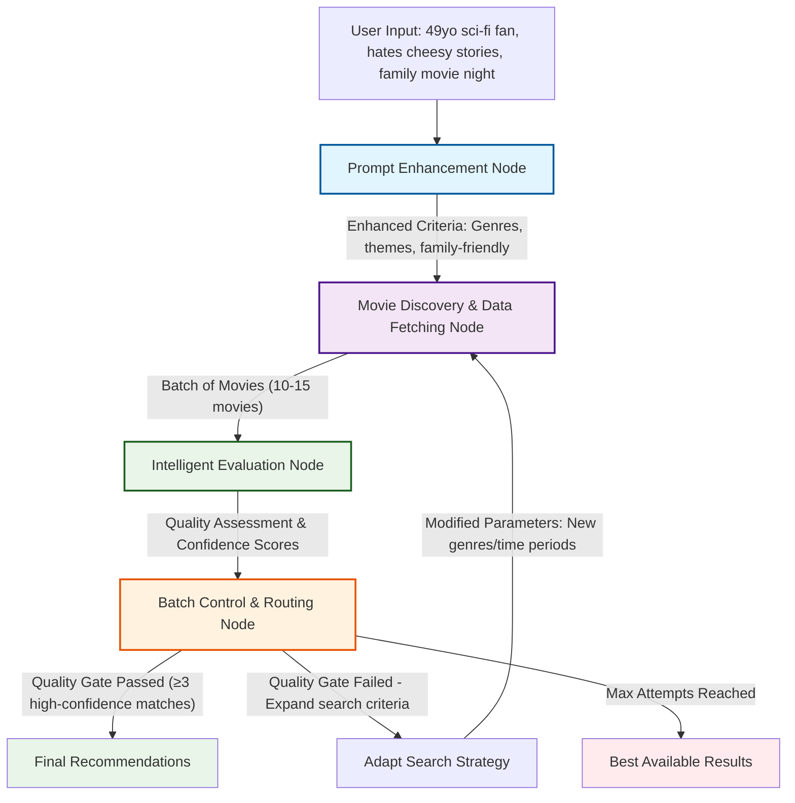

# Video Recommendation Agent - Design Document (Updated)

## Overview

This document outlines the architectural decisions for building a video recommendation agent using modern LangGraph.js v1 and TypeScript. The agent demonstrates a complete 4-node workflow that processes natural language user requests through intelligent prompt enhancement, movie discovery, batch evaluation, and adaptive routing. 

**Educational Focus**: This implementation uses comprehensive fake data simulation and verbose logging to provide a pedagogical example of production-ready LangGraph agent patterns without requiring external APIs or services.

## System Architecture

### High-Level Flow
The agent follows a 4-node architecture with intelligent prompt enhancement and adaptive batch processing:

1. **Prompt Enhancement** → 2. **Movie Discovery & Data Fetching** → 3. **Intelligent Evaluation** → 4. **Batch Control & Routing**

### Architecture Diagram



### Node Design Decisions

#### 1. Prompt Enhancement Node (`prompt_enhancement`)
**Responsibility**: Natural language processing and context enrichment
- **LLM Analysis**: Interprets user's natural language description ("49 years old guy that loves science fiction and hates cheesy stories")
- **Context Expansion**: Adds demographic insights, genre mappings, and preference clarifications
- **Search Strategy**: Generates specific search terms, filters, and quality criteria
- **Family Context**: Identifies family-appropriate content requirements when mentioned
- **Design Choice**: Front-loads intelligence to improve downstream search accuracy

**Example Enhancement**:
```
Input: "I'm a 49 years old guy that loves science fiction and hates cheesy stories"
Enhanced Output: {
  genres: ["Science Fiction", "Thriller", "Drama"],
  excludeGenres: ["Romance", "Comedy", "Musical"],
  ageGroup: "Adult",
  familyFriendly: false,
  preferredThemes: ["Hard sci-fi", "Dystopian", "Space exploration"],
  avoidThemes: ["Romantic subplots", "Slapstick humor", "Overly dramatic"]
}
```

#### 2. Movie Discovery & Data Fetching Node (`movie_discovery_fetching`)
**Responsibility**: Recursive data collection and structured extraction
- **Initial Discovery**: Scrapes movie listing websites using enhanced search criteria
- **Recursive Fetching**: For each discovered movie, recursively fetches detailed information via HTTP calls
- **Link Following**: Automatically follows movie detail links to gather comprehensive data
- **Structured Data Generation**: Converts scraped HTML into structured movie objects with metadata
- **Batch Processing**: Processes movies in configurable batches (default: 10-15 movies per batch)
- **Design Choice**: Combines discovery and detailed fetching for efficiency and data completeness

#### 3. Intelligent Evaluation Node (`intelligent_evaluation`)
**Responsibility**: LLM-powered quality assessment and matching
- **Batch Analysis**: Evaluates the current batch of movies against enhanced user criteria
- **Semantic Matching**: Uses LLM to assess thematic alignment, mood, and content appropriateness
- **Quality Scoring**: Generates confidence scores for each movie's match quality
- **Family Appropriateness**: Evaluates content suitability when family viewing is specified
- **Batch Quality Gate**: Determines if current batch meets minimum quality threshold (e.g., ≥3 high-confidence matches)
- **Design Choice**: Pure LLM approach for nuanced understanding of user preferences and content analysis

#### 4. Batch Control & Routing Node (`batch_control_routing`)
**Responsibility**: Adaptive search management and flow control
- **Quality Assessment**: Reviews evaluation results and batch quality metrics
- **Routing Decisions**: 
  - Success → Compile final recommendations
  - Insufficient Quality → Trigger new batch with expanded/modified search criteria
- **Search Strategy Adaptation**: Adjusts search parameters, genres, or time periods for next iteration
- **Loop Management**: Prevents infinite loops with maximum attempt limits
- **Design Choice**: Centralized adaptive logic for intelligent search refinement

## Key Architectural Decisions

### Enhanced Prompt Processing
- **Decision**: Dedicated LLM-powered prompt enhancement as first step
- **Rationale**: 
  - Transforms vague user requests into structured search criteria
  - Improves search accuracy and relevance
  - Handles contextual requirements (family-friendly, age-appropriate)
  - Reduces downstream processing complexity

### Recursive Data Fetching
- **Decision**: Single node handles both discovery and detailed fetching
- **Rationale**:
  - Minimizes state complexity between discovery and detail fetching
  - Enables intelligent link following and data extraction
  - Batch processing for efficient resource utilization
  - Structured data generation for consistent downstream processing

### Batch-Based Quality Evaluation
- **Decision**: Process and evaluate movies in configurable batches
- **Rationale**:
  - Prevents overwhelming the LLM with too many movies at once
  - Enables early termination when sufficient quality matches are found
  - Allows for adaptive search refinement between batches
  - Better resource management and response times

### Adaptive Search Strategy
- **Decision**: Centralized routing node with search strategy adaptation
- **Rationale**:
  - Intelligent retry logic with modified search criteria
  - Prevents infinite loops while maximizing search coverage
  - Learns from previous batch results to improve next iteration
  - Clear separation between evaluation and flow control logic

### Hybrid Intelligence Approach
- **Decision**: Strategic mix of LLM and deterministic processing
- **Rationale**:
  - LLMs excel at semantic understanding and contextual analysis
  - Deterministic logic handles data fetching and structured operations
  - Combines reliability with intelligent content understanding

### Technology Stack
- **LangGraph.js v1**: Modern workflow orchestration with Annotation.Root() state management
- **TypeScript**: Type safety and better developer experience  
- **Native Node.js HTTP**: Simulated HTTP client for pedagogical web scraping examples
- **Fake Data Simulation**: Comprehensive 10-movie database for realistic agent testing
- **LangChain Integration**: Ready for LLM integration (currently simulated for educational purposes)
- **Winston**: Structured logging with DEBUG level as default for comprehensive tracing

## State Management

### Modern LangGraph v1 State Structure
```typescript
const VideoRecommendationAgentState = Annotation.Root({
  // Input from user
  userInput: Annotation<string>,
  
  // Enhanced criteria from prompt enhancement node
  enhancedUserCriteria: Annotation<UserCriteria | null>,
  
  // Movies discovered and fetched
  discoveredMoviesBatch: Annotation<Movie[]>,
  
  // Evaluation results
  evaluatedMoviesBatch: Annotation<MovieEvaluation[]>,
  qualityGatePassedSuccessfully: Annotation<boolean>,
  highConfidenceMatchCount: Annotation<number>,
  
  // Control flow state
  searchAttemptNumber: Annotation<number>,
  maximumSearchAttempts: Annotation<number>,
  finalRecommendations: Annotation<MovieEvaluation[]>,
  
  // Error handling
  lastErrorMessage: Annotation<string | undefined>,
});
```

### Conditional Routing Logic
- **Success Path**: Prompt Enhancement → Movie Discovery → Intelligent Evaluation → Batch Control → Final Recommendations
- **Retry Path**: Intelligent Evaluation → (Quality Gate Fails) → Batch Control → Movie Discovery (with adapted criteria)
- **Completion Path**: Batch Control → (Max Attempts Reached) → Best Available Results → End
- **Max Iterations**: 3 search attempts with adaptive strategy modification between attempts

## Pedagogical Implementation Approach

### Fake Data Simulation Strategy
The current implementation uses a comprehensive fake data approach for educational purposes:

- **10-Movie Database**: Realistic sci-fi movie catalog with detailed metadata (genres, ratings, directors, themes)
- **Simulated HTTP Requests**: Fake API calls with realistic delays and response sizes for learning HTTP patterns
- **Mock LLM Responses**: Deterministic but realistic confidence scoring and reasoning generation
- **Comprehensive Logging**: Every operation logged with timing, context, and structured data

### Benefits of Simulation Approach
1. **No External Dependencies**: Runs completely offline without API keys or network access
2. **Predictable Behavior**: Consistent results for testing and learning
3. **Realistic Patterns**: Mimics real-world API interactions and LLM behavior
4. **Educational Focus**: Clear visibility into all agent decision-making processes

## Educational Benefits

This architecture demonstrates:

1. **Modern LangGraph v1 Patterns**: Uses latest Annotation.Root() state management
2. **Complex Workflow Orchestration**: Multi-step processes with conditional routing logic
3. **Hybrid AI Systems**: Combining simulated LLM analysis with deterministic processing
4. **Adaptive Search Strategy**: Quality gate evaluation with intelligent retry mechanisms
5. **Error Handling**: Graceful degradation and max attempt limits
6. **State Management**: Persistent state across async operations using modern patterns
7. **Modular Design**: Clear separation of concerns between specialized nodes
8. **Comprehensive Logging**: Production-ready Winston logging with structured tracing

## Future Enhancements

### Phase 2 Improvements
- Enhanced quality gate with weighted scoring
- Parallel processing for movie detail fetching
- Machine learning-based user preference learning
- Integration with legal streaming APIs

### Advanced Features
- Real-time availability monitoring
- Social recommendation features
- Content similarity clustering
- Personalized quality metrics

## Implementation Notes

### LangGraph v1 Modernization
- **State Definition**: Uses modern `Annotation.Root()` pattern instead of deprecated channels
- **Type Safety**: Improved TypeScript integration with `typeof VideoRecommendationAgentState.State`
- **Constructor**: Modern `new StateGraph(VideoRecommendationAgentState)` syntax
- **Future-Proof**: Compatible with latest LangGraph.js ecosystem updates

### Simulation Architecture
- **Fake HTTP Operations**: Realistic delays and response patterns for learning
- **Mock LLM Calls**: Deterministic scoring with educational transparency
- **Quality Gate Logic**: Real adaptive search strategy with simulated evaluation
- **Error Boundaries**: Prevent single failures from crashing the entire workflow

### **Winston Logging**: Comprehensive structured logging with DEBUG level default
- Node-level execution tracking with timing metrics
- HTTP request/response logging for simulated data fetching operations  
- LLM interaction logging with simulated token usage and response times
- Quality gate evaluation results and decision reasoning
- Search strategy adaptation tracking for iterative improvements
- Context-aware child loggers for different system components
