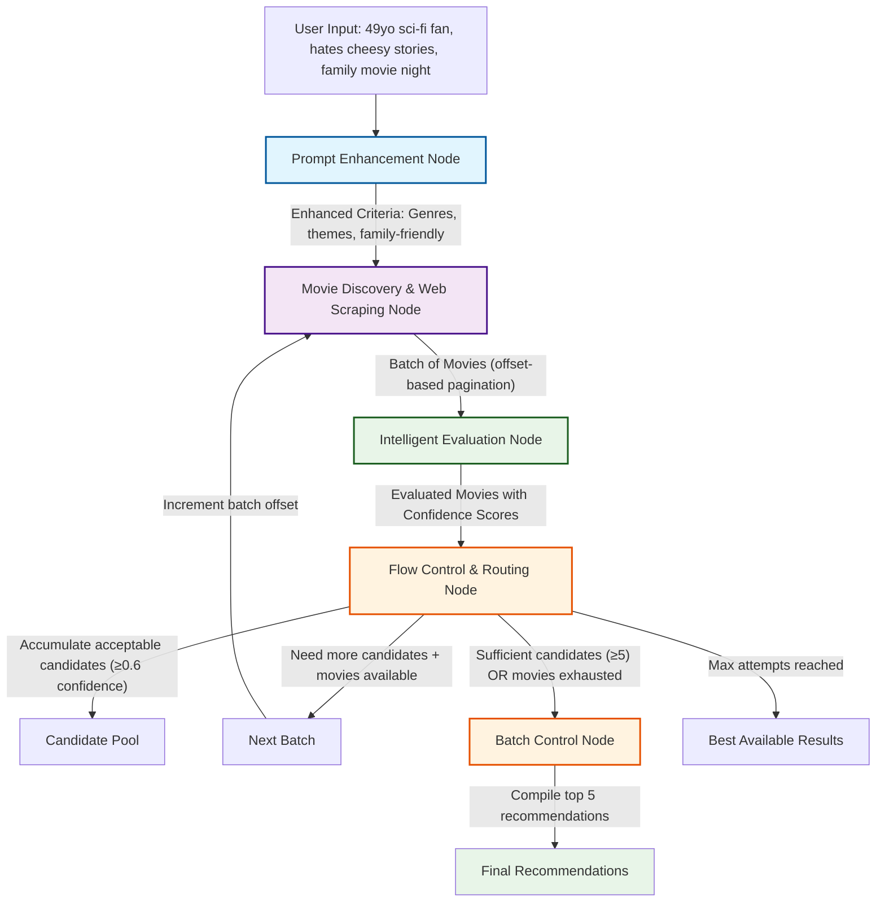

# Video Recommendation Agent - Design Document (Current Implementation)

## Overview

This document outlines the architectural decisions for building a production-ready video recommendation agent using modern LangGraph.js v1 and TypeScript. The agent implements a sophisticated 4-node workflow with pagination-based processing that handles natural language user requests through intelligent prompt enhancement, web scraping-based movie discovery, LLM-powered batch evaluation, and adaptive candidate accumulation.

**Production Focus**: This implementation features real AWS Bedrock integration, live web scraping of Prime Video, SQLite database caching, and comprehensive logging to demonstrate enterprise-grade LangGraph agent patterns with actual external service integrations.

## System Architecture

### High-Level Flow
The agent follows a 4-node architecture with pagination-based candidate accumulation and intelligent routing:

1. **Prompt Enhancement** → 2. **Movie Discovery & Data Fetching** → 3. **Intelligent Evaluation** → 4. **Flow Control & Candidate Accumulation**

The system processes movies in paginated batches, accumulating acceptable candidates until it reaches the minimum required recommendations (default: 5) or exhausts all available movies.

### Architecture Diagram



### Node Design Decisions

#### 1. Prompt Enhancement Node (`prompt_enhancement`)
**Responsibility**: Natural language processing and context enrichment
- **LLM Analysis**: Interprets user's natural language description ("49 years old guy that loves science fiction and hates cheesy stories")
- **Context Expansion**: Adds demographic insights, genre mappings, and preference clarifications
- **Search Strategy**: Generates specific search terms, filters, and quality criteria
- **Family Context**: Identifies family-appropriate content requirements when mentioned
- **Design Choice**: Front-loads intelligence to improve downstream search accuracy

**Example Enhancement**:
```
Input: "I'm a 49 years old guy that loves science fiction and hates cheesy stories"
Enhanced Output: {
  genres: ["Science Fiction", "Thriller", "Drama"],
  excludeGenres: ["Romance", "Comedy", "Musical"],
  ageGroup: "Adult",
  familyFriendly: false,
  preferredThemes: ["Hard sci-fi", "Dystopian", "Space exploration"],
  avoidThemes: ["Romantic subplots", "Slapstick humor", "Overly dramatic"]
}
```

#### 2. Movie Discovery & Data Fetching Node (`movie_discovery_and_data_fetching_node`)
**Responsibility**: Prime Video web scraping with intelligent caching and pagination
- **Web Scraping**: Real-time scraping of Prime Video movie listings using Cheerio HTML parser
- **Cache Integration**: SQLite database caching to avoid redundant scraping and processing
- **Batch Processing**: Pagination-based processing with configurable batch sizes (default: 10 movies)
- **LLM Normalization**: Claude 3 Haiku-powered metadata standardization and theme extraction
- **Rate Limiting**: Proper headers and delays to avoid detection while respecting service resources
- **Structured Output**: Converts raw scraped data into typed Movie objects with comprehensive metadata
- **Design Choice**: Real web scraping combined with intelligent caching for production reliability

#### 3. Intelligent Evaluation Node (`intelligent_evaluation_node`)
**Responsibility**: Claude 3.5 Sonnet-powered movie evaluation and quality assessment
- **Parallel Batch Evaluation**: Evaluates current movie batch against enhanced user criteria using Promise.allSettled
- **Multi-Dimensional Analysis**: Advanced reasoning across genre alignment, theme matching, age appropriateness, quality indicators, and cultural relevance
- **Confidence Scoring**: Generates 0.0-1.0 confidence scores with detailed reasoning explanations
- **Family Appropriateness**: Comprehensive content suitability assessment for family viewing contexts
- **Candidate Filtering**: Identifies acceptable candidates (≥0.6 confidence) for accumulation in candidate pool
- **Design Choice**: Claude 3.5 Sonnet for superior reasoning capabilities in complex multi-dimensional movie analysis

#### 4. Flow Control & Batch Control Node (`shouldContinueSearching` + `batch_control_and_routing_node`)
**Responsibility**: Pagination management, candidate accumulation, and final recommendation compilation
- **Candidate Accumulation**: Collects acceptable candidates (≥0.6 confidence) across multiple batches
- **Pagination Logic**: Manages batch offsets and determines when more movies are available for processing
- **Threshold Management**: Continues processing until minimum candidates (5) are found or movies exhausted
- **Final Compilation**: Sorts accumulated candidates by confidence score and selects top 5 recommendations
- **Adaptive Termination**: Balances quality requirements with available movie inventory
- **Design Choice**: Pagination-based approach ensures comprehensive coverage while maintaining performance

## Key Architectural Decisions

### Enhanced Prompt Processing
- **Decision**: Dedicated Claude 3 Haiku-powered prompt enhancement as first step
- **Rationale**: 
  - Transforms vague user requests into structured search criteria with genre mapping and theme extraction
  - Improves downstream search accuracy and relevance through semantic understanding
  - Handles complex contextual requirements (family-friendly, age-appropriate content)
  - Cost-effective model choice for fast text analysis without sacrificing quality

### Production Web Scraping with Caching
- **Decision**: Real-time Prime Video scraping with SQLite caching layer
- **Rationale**:
  - Live data ensures current movie availability and pricing information
  - Intelligent caching minimizes redundant scraping and improves performance
  - Rate limiting and proper headers maintain ethical scraping practices
  - LLM-powered normalization ensures consistent data quality

### Pagination-Based Candidate Accumulation
- **Decision**: Process movies in paginated batches while accumulating acceptable candidates
- **Rationale**:
  - Prevents overwhelming Claude 3.5 Sonnet with large batch sizes for optimal reasoning quality
  - Enables early termination when sufficient high-quality candidates are found
  - Better resource management and cost control for production LLM usage
  - Maintains comprehensive coverage of available movie inventory

### Intelligent Threshold Management
- **Decision**: Candidate accumulation with configurable quality thresholds
- **Rationale**:
  - Balances recommendation quality with system responsiveness
  - Ensures sufficient variety in final recommendations through continued search
  - Prevents infinite processing loops with clear termination conditions
  - Adapts to movie availability and user criteria specificity

### Production LLM Integration
- **Decision**: AWS Bedrock with model-specific optimization (Haiku for speed, Sonnet for reasoning)
- **Rationale**:
  - Enterprise-grade reliability and security for production deployments
  - Model selection optimized for specific tasks (fast text analysis vs. complex reasoning)
  - Comprehensive error handling and fallback strategies for service resilience
  - Structured output validation using Zod schemas for data consistency

### Technology Stack
- **LangGraph.js v1**: Modern workflow orchestration with Annotation.Root() state management
- **TypeScript**: Type safety and better developer experience  
- **AWS Bedrock**: Production LLM integration via @langchain/aws ChatBedrockConverse
  - **Claude 3 Haiku**: Fast prompt enhancement and content analysis
  - **Claude 3.5 Sonnet**: Advanced reasoning for movie evaluation
- **Web Scraping**: Live Prime Video scraping using Cheerio HTML parser
- **SQLite Database**: Production movie caching with better-sqlite3
- **Winston**: Structured logging with DEBUG level as default for comprehensive tracing
- **Zod**: Runtime schema validation for LLM outputs and data consistency

## State Management

### Modern LangGraph v1 State Structure
```typescript
const VideoRecommendationAgentState = Annotation.Root({
  // Input from user
  userInput: Annotation<string>,
  
  // Enhanced criteria from prompt enhancement node
  enhancedUserCriteria: Annotation<UserCriteria | null>,
  
  // Movie discovery and pagination state
  allDiscoveredMovies: Annotation<Movie[]>, // All movies found so far
  discoveredMoviesBatch: Annotation<Movie[]>, // Current batch for evaluation
  movieBatchOffset: Annotation<number>, // Current position in all movies
  movieBatchSize: Annotation<number>, // How many movies to send to evaluation per batch
  
  // Evaluation results and candidate accumulation
  evaluatedMoviesBatch: Annotation<MovieEvaluation[]>, // Current batch evaluations
  allAcceptableCandidates: Annotation<MovieEvaluation[]>, // All good candidates so far
  qualityGatePassedSuccessfully: Annotation<boolean>,
  highConfidenceMatchCount: Annotation<number>,
  minimumAcceptableCandidates: Annotation<number>, // Minimum candidates needed (default: 5)
  
  // Control flow state
  searchAttemptNumber: Annotation<number>,
  maximumSearchAttempts: Annotation<number>,
  finalRecommendations: Annotation<MovieEvaluation[]>,
  
  // Error handling
  lastErrorMessage: Annotation<string | undefined>,
});
```

### Conditional Routing Logic
- **Primary Path**: Prompt Enhancement → Movie Discovery → Intelligent Evaluation → Flow Control (accumulate candidates)
- **Pagination Path**: Flow Control → (Need more candidates + movies available) → Movie Discovery (next batch with offset)
- **Completion Path**: Flow Control → (Sufficient candidates ≥5 OR movies exhausted) → Batch Control → Final Recommendations
- **Fallback Path**: Flow Control → (Max attempts reached) → Batch Control → Best Available Results → End
- **Candidate Threshold**: Minimum 5 acceptable candidates (≥0.6 confidence score) before finalizing recommendations

## Production Implementation Approach

### Real-World Integration Strategy
The current implementation uses production-grade services and APIs:

- **AWS Bedrock Integration**: Live Claude 3 Haiku and 3.5 Sonnet models with proper authentication
- **Prime Video Web Scraping**: Real-time data fetching with Cheerio HTML parsing and anti-detection measures
- **SQLite Database**: Persistent movie caching with better-sqlite3 for production performance
- **Comprehensive Monitoring**: Every operation logged with timing, costs, and success metrics

### Benefits of Production Approach
1. **Real Data Quality**: Current movie availability, ratings, and metadata from live sources
2. **Scalable Architecture**: Caching, pagination, and batch processing for production loads
3. **Enterprise Reliability**: Error handling, fallback strategies, and service resilience
4. **Cost Optimization**: Smart caching and model selection to minimize operational expenses

## Production Benefits

This architecture demonstrates:

1. **Modern LangGraph v1 Patterns**: Latest Annotation.Root() state management with pagination support
2. **Complex Workflow Orchestration**: Multi-step processes with intelligent candidate accumulation
3. **Production LLM Integration**: Real AWS Bedrock integration with Claude 3 Haiku and 3.5 Sonnet
4. **Web Scraping at Scale**: Live data fetching with caching, rate limiting, and error recovery
5. **Performance Optimization**: Pagination, caching, and batch processing for production scalability
6. **Data Consistency**: Zod schema validation and SQLite persistence for reliable data handling
7. **Modular Architecture**: Clear separation of concerns with specialized service layers
8. **Enterprise Logging**: Production-ready Winston logging with structured tracing and debugging

## Future Enhancements

### Phase 2 Improvements
- **Multi-Platform Scraping**: Extend beyond Prime Video to Netflix, Hulu, Disney+, etc.
- **Parallel Batch Processing**: Concurrent evaluation of multiple movie batches for improved performance
- **Advanced User Modeling**: Machine learning-based preference learning from user feedback and ratings
- **Streaming Availability APIs**: Integration with JustWatch or similar services for comprehensive availability data

### Advanced Features
- **Real-Time Price Monitoring**: Track subscription costs and promotional offers across platforms
- **Social Recommendation Engine**: Incorporate ratings and reviews from trusted critics and friends
- **Content Similarity Engine**: Vector embeddings for advanced content-based filtering and clustering
- **Personalized Quality Metrics**: Adaptive scoring based on individual user viewing history and preferences

## Implementation Notes

### LangGraph v1 Modernization
- **State Definition**: Uses modern `Annotation.Root()` pattern instead of deprecated channels
- **Type Safety**: Improved TypeScript integration with `typeof VideoRecommendationAgentState.State`
- **Constructor**: Modern `new StateGraph(VideoRecommendationAgentState)` syntax
- **Future-Proof**: Compatible with latest LangGraph.js ecosystem updates

### Production Architecture
- **Real HTTP Operations**: Live web scraping with proper rate limiting and error handling
- **Production LLM Calls**: AWS Bedrock integration with cost tracking and response validation
- **Intelligent Caching**: SQLite database with cache hit optimization and performance metrics
- **Error Boundaries**: Comprehensive error recovery and graceful degradation strategies

### Production Logging with Winston
- Node-level execution tracking with timing and performance metrics
- HTTP request/response logging for web scraping operations with success rates
- LLM interaction logging with token usage, costs, and response quality metrics
- Candidate accumulation and quality gate evaluation with detailed decision reasoning
- Cache performance monitoring and database operation tracking
- Context-aware child loggers for different system components and services
