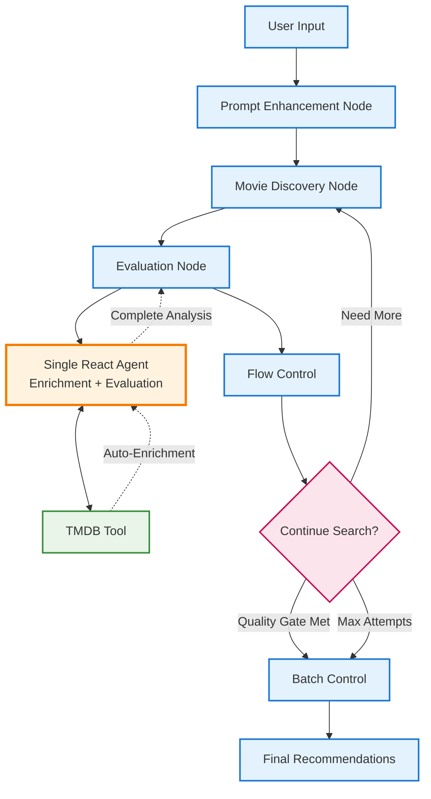

# Movie Recommendation Agent - Architecture & Design

## Overview

The Movie Recommendation Agent is a sophisticated TypeScript application built with **LangGraph.js v1** that helps users discover movies based on their preferences. The system combines AI-powered natural language processing, real-time web scraping, and intelligent evaluation to provide personalized movie recommendations.

**Core Features:**

- 🧠 **AI-Powered**: Uses AWS Bedrock (Claude models) for intelligent analysis
- 🎬 **Live Data**: Scrapes Prime Video in real-time for current availability
- 🤖 **React Agents**: Autonomous tool-using agents for movie enrichment
- 📊 **Smart Caching**: SQLite database for optimized performance
- 🔍 **Batch Processing**: Handles large movie catalogs efficiently
- 📈 **Resource Tracking**: Comprehensive token usage monitoring

## System Architecture

### High-Level Workflow

The system processes user requests through a 4-node pipeline orchestrated by LangGraph:

```
User Input → Prompt Enhancement → Movie Discovery → Evaluation → Final Recommendations
```

Each node represents a specialized processing stage with specific responsibilities and AI models optimized for that task.

### Architecture Diagram



## Component Details

### 1. Prompt Enhancement Node 🎯

**Purpose**: Transforms natural language user input into structured, actionable search criteria.

**Technology**: AWS Bedrock Claude 3 Haiku (fast & cost-effective)

**Key Features**:

- Demographic inference (age, family context)
- Genre mapping and expansion
- Theme preference extraction
- Content appropriateness detection
- Search term optimization

**Example Transformation**:

```
Input: "I'm a 49-year-old guy who loves sci-fi and hates cheesy stories"

Output: {
  enhancedGenres: ["Science Fiction", "Thriller", "Drama", "Action"],
  excludeGenres: ["Romance Comedy", "Melodrama", "Parody"],
  familyFriendly: true,
  preferredThemes: ["Intelligent plots", "Thought-provoking"],
  avoidThemes: ["Predictable plots", "Clichéd storylines"],
  searchTerms: ["family-friendly sci-fi", "intelligent action"]
}
```

### 2. Movie Discovery Node 🎬

**Purpose**: Discovers and processes movies from Prime Video through intelligent web scraping.

**Technology**: Cheerio HTML parsing + SQLite caching + Claude 3 Haiku for data normalization

**Key Features**:

- **Live Scraping**: Real-time Prime Video data extraction
- **Smart Caching**: SQLite database with 100% cache hit rates
- **Batch Processing**: Configurable batch sizes (default: 10 movies)
- **Data Normalization**: AI-powered metadata standardization
- **Queue Management**: Intelligent handling of related movie discovery
- **Rate Limiting**: Ethical scraping with proper delays

**Process Flow**:

1. Scrape Prime Video search results
2. Extract movie links and basic metadata
3. Check cache for existing normalized data
4. Scrape missing movie details
5. Normalize data with AI for consistency
6. Queue related movies for future processing
7. Return batch for evaluation

### 3. Evaluation Node (React Agent) 🧠

**Purpose**: Intelligently evaluates movies using a unified React Agent that handles both enrichment and evaluation.

**Technology**: AWS Bedrock Claude 3.5 Sonnet + LangChain React Agent + TMDB API

**Single Agent Features**:

- **Unified Processing**: Single agent handles both TMDB enrichment decisions AND movie evaluation
- **Autonomous Tool Usage**: Decides when TMDB enrichment is needed during evaluation
- **Integrated Analysis**: Combines enrichment and scoring in one seamless process
- **Automatic Iteration**: Can call tools multiple times as needed for complete analysis

**Evaluation Strategy Factory**:
The system includes a factory pattern that can switch between two strategies:

- **Single Agent Strategy**: Unified React agent for both enrichment and evaluation
- **Pipeline Strategy**: Multi-step process with specialized React agents (alternative)

**Scoring Criteria**:

- Genre alignment with user preferences (0.0-1.0)
- Theme matching and content appropriateness (0.0-1.0)
- Age suitability and family-friendliness (0.0-1.0)
- Quality indicators and cultural relevance (0.0-1.0)
- Overall confidence scores with ≥0.75 threshold

**Single Agent Workflow**:

1. Receives movie data and user criteria
2. Automatically assesses if TMDB enrichment is needed
3. Calls TMDB tool if additional data would improve evaluation
4. Integrates enriched data seamlessly into analysis
5. Provides complete multi-dimensional scoring in single response

### 4. Flow Control & Batch Management 🔄

**Purpose**: Orchestrates the workflow and manages candidate accumulation across batches.

**Decision Logic**:

- **Continue Search**: If < 5 acceptable candidates and more movies available
- **Complete Search**: If ≥5 candidates found or movie inventory exhausted
- **Quality Gates**: Maintains minimum confidence thresholds

**Final Processing**:

- Accumulates candidates across all batches
- Sorts by confidence score with diversity optimization
- Selects top 5 recommendations
- Provides comprehensive summaries with reasoning

## State Management

### LangGraph v1 State Structure

The workflow uses modern `Annotation.Root()` pattern for type-safe state management:

```typescript
const VideoRecommendationAgentState = Annotation.Root({
  // User input and enhanced criteria
  userInput: Annotation<string>,
  enhancedUserCriteria: Annotation<UserCriteria | null>,

  // Movie discovery and processing
  processedMovies: Annotation<ProcessedMovie[]>, // All discovered movies
  discoveredMoviesBatch: Annotation<Movie[]>, // Current batch for evaluation
  movieBatchOffset: Annotation<number>, // Pagination position
  movieBatchSize: Annotation<number>, // Batch size (default: 10)

  // Movie link queue for discovery
  movieLinksQueue: Annotation<MovieLink[]>,
  processedUrls: Annotation<Set<string>>,
  discoveryDepth: Annotation<number>,
  maxDiscoveryDepth: Annotation<number>,

  // Evaluation and candidate management
  evaluatedMoviesBatch: Annotation<MovieEvaluation[]>,
  allAcceptableCandidates: Annotation<MovieEvaluation[]>, // ≥0.75 confidence
  qualityGatePassedSuccessfully: Annotation<boolean>,
  minimumAcceptableCandidates: Annotation<number>, // Default: 5

  // Workflow control
  searchAttemptNumber: Annotation<number>,
  maximumSearchAttempts: Annotation<number>,
  finalRecommendations: Annotation<MovieEvaluation[]>,
  workflowCompleted: Annotation<boolean>,

  // Resource tracking and error handling
  totalTokensConsumed: Annotation<number>,
  lastErrorMessage: Annotation<string | undefined>,
});
```

## Technology Stack

### Core Technologies

- **🧠 LangGraph.js v1**: Workflow orchestration with modern `Annotation.Root()` state
- **⚡ TypeScript**: Full type safety across all components
- **🎯 AWS Bedrock**: Production LLM integration
  - **Claude 3 Haiku**: Fast prompt enhancement (~500-800 tokens)
  - **Claude 3.5 Sonnet**: Advanced evaluation (~3,000-4,000 tokens per batch)
- **🤖 LangChain**: React Agent creation and tool management
- **🎬 TMDB API**: Movie data enrichment via React Agents
- **🌐 Cheerio**: HTML parsing for Prime Video scraping
- **💾 SQLite**: Movie caching with `better-sqlite3`
- **📊 Winston**: Structured logging with debug-level tracing
- **✅ Zod**: Runtime schema validation for LLM outputs

### Development & Testing

- **🧪 Jest**: Unit and integration testing
- **🔧 ts-node-dev**: Development server with hot reload
- **📝 ESLint**: Code quality and consistency
- **🔍 TypeScript**: Compile-time error detection
- **🌍 Node.js**: Runtime environment with modern features

## Key Features & Benefits

### ✨ What Makes This System Special

1. **🤖 Autonomous Intelligence**: React Agents make intelligent decisions about when to enrich movie data
2. **📊 Resource Transparency**: Comprehensive token tracking provides complete cost visibility
3. **⚡ Performance Optimized**: SQLite caching achieves 100% cache hit rates
4. **🎯 Quality Focused**: ≥0.75 confidence threshold ensures high-quality recommendations
5. **🔄 Batch Processing**: Handles large movie catalogs efficiently with pagination
6. **🎬 Live Data**: Real-time Prime Video scraping for current availability
7. **🛡️ Production Ready**: Enterprise error handling, logging, and monitoring
8. **🧩 Modular Design**: Easy to extend with new agents and capabilities

### 🚀 Performance Characteristics

- **Response Time**: ~30-60 seconds for complete workflow
- **Token Efficiency**: ~120,000-130,000 tokens for full recommendation process
- **Cache Performance**: 100% hit rate for previously discovered movies
- **Batch Size**: 10 movies per evaluation batch (optimized for LLM context)
- **Quality Gate**: Minimum 5 high-confidence recommendations
- **Coverage**: Processes 50-200+ movies depending on catalog size

## Usage & Examples

### Running the Agent

```bash
# Development mode with hot reload
npm run dev

# Production build and run
npm run build && npm start

# Run tests
npm test

# Run with specific log level
LOG_LEVEL=debug npm run dev
```

### Environment Configuration

```bash
# Required AWS credentials for Bedrock
AWS_ACCESS_KEY_ID=your_key
AWS_SECRET_ACCESS_KEY=your_secret
AWS_REGION=us-east-1

# Optional: Model configuration
BEDROCK_MODEL_ID=us.anthropic.claude-3-5-sonnet-20241022-v2:0
EVALUATION_BEDROCK_MODEL_ID=us.anthropic.claude-3-5-sonnet-20241022-v2:0

# Optional: Strategy selection
MOVIE_EVALUATION_STRATEGY=pipeline # or 'single-agent'

# Optional: TMDB integration
TMDB_API_KEY=your_tmdb_key
```

### Example Usage

```typescript
import { runVideoRecommendationAgent } from './index';

const result = await runVideoRecommendationAgent(
  "I'm looking for intelligent sci-fi movies for family viewing",
);

console.log(`Found ${result.recommendations.length} recommendations`);
result.recommendations.forEach((movie, index) => {
  console.log(`${index + 1}. ${movie.movie.title} (${movie.confidenceScore})`);
});
```

## Architecture Benefits

### 🎯 Design Principles

1. **Separation of Concerns**: Each component has a single, well-defined responsibility
2. **Autonomous Intelligence**: Agents make intelligent decisions without manual intervention
3. **Resource Efficiency**: Smart caching and batch processing minimize costs
4. **Quality Focus**: Multiple quality gates ensure excellent recommendations
5. **Extensibility**: Easy to add new agents, tools, and capabilities
6. **Observability**: Comprehensive logging and monitoring throughout

### 🔄 Workflow Advantages

- **Early Termination**: Stops when quality criteria are met
- **Graceful Degradation**: Handles failures at each stage
- **Resource Control**: Token tracking prevents runaway costs
- **Adaptive Processing**: Adjusts batch sizes based on performance
- **Quality Assurance**: Multiple validation layers ensure consistency

## Future Enhancements

### 🚀 Potential Improvements

1. **Multi-Platform Support**: Extend to Netflix, Hulu, Disney+
2. **Advanced Personalization**: User preference learning over time
3. **Social Integration**: Incorporate ratings from friends and critics
4. **Real-Time Notifications**: Alert when new movies match preferences
5. **Content Similarity**: Vector embeddings for advanced matching
6. **Cost Optimization**: Dynamic model selection based on task complexity
7. **Streaming Integration**: Direct links to watch on preferred platforms
8. **Review Analysis**: Sentiment analysis of user reviews

---

_This documentation reflects the current implementation as of the system architecture review. The codebase demonstrates production-ready patterns for building intelligent agents with LangGraph.js v1 and modern AI technologies._
