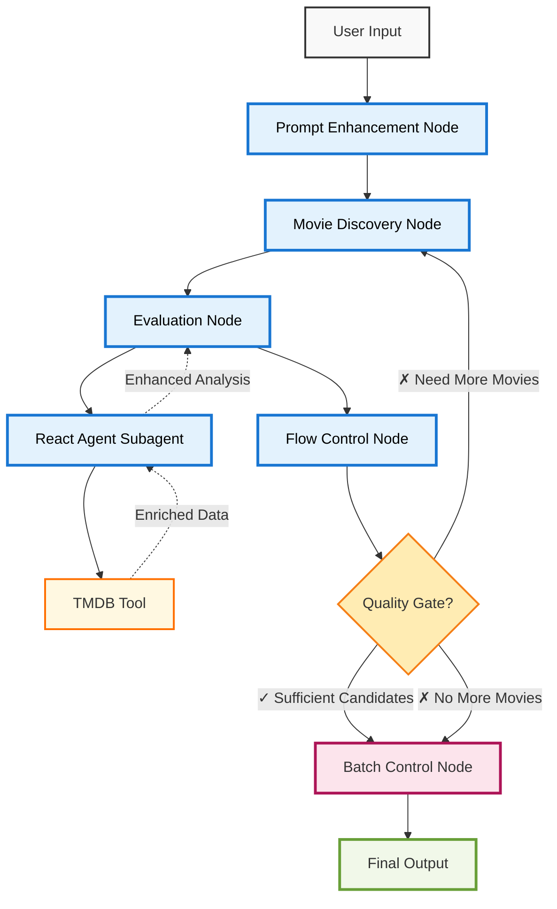

# Video Recommendation Multi-Agent System - Design Document (Current Implementation)

## Overview

This document outlines the architectural decisions for building a production-ready video recommendation **Multi-Agent System (MAS)** using modern LangGraph.js v1 and TypeScript. The system implements a sophisticated multi-agent architecture with specialized agents orchestrated through a 4-node workflow, featuring autonomous React Agent patterns, intelligent tool usage, and collaborative agent coordination for complex movie recommendation tasks.

**Multi-Agent Architecture**: The system demonstrates a sophisticated **composite multi-agent architecture** where specialized agents collaborate under LangGraph orchestration. Each agent has distinct capabilities: prompt enhancement, movie discovery, autonomous evaluation with tool usage, and flow control coordination.

**React Agent Integration**: Features a production-validated React Agent subagent that autonomously manages TMDB movie enrichment, showcasing intelligent tool selection and seamless data integration within the larger multi-agent workflow.

**Production Focus**: This implementation features real AWS Bedrock integration, live web scraping of Prime Video, SQLite database caching, comprehensive token consumption tracking, and enterprise-grade logging to demonstrate production-ready multi-agent system patterns with actual external service integrations.

**Token Monitoring**: The system includes comprehensive token consumption tracking across all agent operations, providing visibility into resource usage with detailed breakdowns of input/output tokens, operation counts, and cost analysis for production optimization.

## Multi-Agent System Architecture

### High-Level Multi-Agent Flow

The **Multi-Agent System (MAS)** features specialized agents orchestrated through a 4-node LangGraph workflow with intelligent agent coordination:

1. **Prompt Enhancement Agent** → 2. **Movie Discovery Pipeline** → 3. **React Agent Evaluation** → 4. **Flow Control & Orchestration**

The system demonstrates **emergent intelligence** through agent collaboration, with each specialized agent contributing unique capabilities while the React Agent subagent autonomously manages tool usage for optimal evaluation quality.

### Multi-Agent Architecture Diagram



### Multi-Agent Component Design

#### 1. Prompt Enhancement Agent (`prompt_enhancement_node`)

**Agent Type**: **Specialized LLM Agent** - Claude 3 Haiku-powered natural language interpreter

**Responsibility**: Natural language processing and context enrichment with token tracking

- **LLM Analysis**: Interprets user's natural language description using Claude 3 Haiku for fast, cost-effective analysis
- **Context Expansion**: Adds demographic insights, genre mappings, and comprehensive preference clarifications
- **Search Strategy**: Generates specific search terms, filters, and quality criteria optimized for Prime Video discovery
- **Family Context**: Identifies family-appropriate content requirements and content rating preferences
- **Token Monitoring**: Tracks input/output tokens for cost analysis (~500-800 tokens per operation)
- **Agent Design Choice**: Specialized agent front-loads intelligence to improve downstream search accuracy while monitoring resource consumption

**Example Enhancement**:

```
Input: "I'm a 49 years old guy that loves science fiction and hates cheesy stories"
Enhanced Output: {
  genres: ["Science Fiction", "Thriller", "Drama", "Action", "Adventure"],
  excludeGenres: ["Romance Comedy", "Melodrama", "Slapstick Comedy", "Parody"],
  ageGroup: "Adult",
  familyFriendly: true,
  preferredThemes: ["Intelligent plots", "Thought-provoking", "Action-packed"],
  avoidThemes: ["Predictable plots", "Clichéd storylines"],
  searchTerms: ["family-friendly sci-fi", "intelligent action"]
}
```

#### 2. Movie Discovery Pipeline (`movie_discovery_and_data_fetching_node`)

**Architecture Type**: **Hybrid Pipeline** - Combines deterministic scraping with specialized data normalization agent

**Responsibility**: Prime Video web scraping with intelligent caching, pagination, and agent-powered data normalization

- **Web Scraping**: Real-time scraping of Prime Video movie listings using Cheerio HTML parser with simplified text extraction
- **Cache Integration**: SQLite database caching achieving 100% cache hit rates for optimal performance
- **Batch Processing**: Pagination-based processing with configurable batch sizes (default: 10 movies)
- **Data Normalization Agent**: Claude 3 Haiku-powered metadata standardization and theme extraction with token monitoring
- **Non-Agent Components**: Web scraper (deterministic), cache system (data persistence), rate limiting (rule-based)
- **Rate Limiting**: Proper headers and delays to avoid detection while respecting service resources
- **Structured Output**: Converts raw scraped data into typed Movie objects with comprehensive metadata
- **Token Tracking**: Monitors normalization agent operations for cost analysis and performance optimization
- **Pipeline Design Choice**: Hybrid approach combining deterministic data fetching with intelligent agent-powered normalization for production reliability

#### 3. Movie Evaluation React Agent (`intelligent_evaluation_node`)

**Agent Type**: **React Agent Subagent** - Autonomous tool-enabled agent within the larger MAS

**Responsibility**: React Agent-powered movie evaluation with autonomous TMDB enrichment and advanced quality assessment

- **React Agent Integration**: Implements ReAct (Reasoning + Acting) pattern using LangChain's createAgent from 'langchain' package
- **Autonomous Tool Usage**: Agent automatically decides when to use TMDB enrichment based on data quality and completeness
- **Intelligent Decision Making**: Evaluates movie descriptions, genre classifications, and metadata to determine enrichment necessity
- **Parallel Batch Evaluation**: Evaluates current movie batch against enhanced user criteria using Promise.allSettled for optimal performance
- **TMDB Auto-Enrichment**: Seamless integration of TMDB movie data when agent determines additional information is needed
- **Tool Execution Flow**: Automated tool invocation and result integration without manual intervention
- **Rate-Limited Enrichment**: TMDB API calls intelligently managed with SQLite caching to minimize API usage
- **Multi-Dimensional Analysis**: Advanced reasoning across genre alignment, theme matching, age appropriateness, quality indicators, and cultural relevance
- **Confidence Scoring**: Generates 0.0-1.0 confidence scores with detailed reasoning explanations (typically 75-85% for high matches)
- **Quality Gate Optimization**: Uses ≥0.75 confidence threshold for high-quality matches (optimized from previous 0.6 threshold)
- **Family Appropriateness**: Comprehensive content suitability assessment for family viewing contexts
- **Candidate Filtering**: Identifies acceptable candidates (≥0.75 confidence) for accumulation in candidate pool
- **Token Monitoring**: Comprehensive tracking of Claude 3.5 Sonnet operations + tool usage (~3,000-4,000 tokens per 10-movie batch)
- **Production Validated**: Successfully tested in live environment with autonomous tool usage and optimal performance
- **Subagent Design Choice**: React Agent subagent architecture for intelligent, autonomous movie analysis within the larger multi-agent system coordination

#### 4. Flow Control & Multi-Agent Orchestration (`shouldContinueSearching` + `batch_control_and_routing_node`)

**Architecture Type**: **Rule-Based Orchestration System** - Coordinates multi-agent workflow execution

**Responsibility**: Multi-agent coordination, pagination management, candidate accumulation, final recommendation compilation, and token reporting

- **Candidate Accumulation**: Collects acceptable candidates (≥0.75 confidence) across multiple batches
- **Pagination Logic**: Manages batch offsets and determines when more movies are available for processing
- **Threshold Management**: Continues processing until minimum candidates (5) are found or movies exhausted
- **Final Compilation**: Sorts accumulated candidates by confidence score and selects top 5 recommendations with diversity optimization
- **Comprehensive Output**: Includes movie descriptions, detailed reasoning, and complete metadata in final display
- **Token Reporting**: Provides comprehensive usage summary with total tokens, input/output breakdown, and operation count
- **Multi-Agent Coordination**: Orchestrates execution flow between specialized agent components
- **Adaptive Termination**: Balances quality requirements with available movie inventory and resource consumption
- **Orchestration Design Choice**: Rule-based coordination system with complete transparency into multi-agent resource usage and recommendation quality

## Multi-Agent System Architecture

### System Classification

Our implementation represents a **Composite Multi-Agent System (MAS)** with the following architectural characteristics:

- **LangGraph = Orchestration Framework**: LangGraph serves as the multi-agent coordination framework, not an agent itself
- **Specialized Agent Components**: Each LLM-powered component is a specialized agent with distinct capabilities
- **React Agent Subagent**: The evaluation component contains an autonomous React Agent for tool management
- **Emergent Intelligence**: The system exhibits intelligent behavior through agent collaboration
- **Hierarchical Structure**: Workflow-level orchestration with task-level specialized agents

### Agent Classification Matrix

| Component                 | Type                | Intelligence   | Autonomy          | Tools    |
| ------------------------- | ------------------- | -------------- | ----------------- | -------- |
| **LangGraph Workflow**    | Orchestrator        | Rule-based     | Coordinated       | None     |
| **Prompt Enhancement**    | Specialized Agent   | LLM-powered    | Goal-oriented     | None     |
| **Movie Discovery**       | Hybrid Pipeline     | Mixed          | Semi-autonomous   | Web APIs |
| **Data Normalizer**       | Specialized Agent   | LLM-powered    | Task-focused      | None     |
| **React Agent Evaluator** | **Subagent**        | **Autonomous** | **Self-directed** | **TMDB** |
| **Flow Control**          | Orchestration Logic | Rule-based     | Deterministic     | None     |
| **Web Scraper**           | Tool/Service        | Deterministic  | Programmatic      | HTTP     |
| **Cache System**          | Tool/Service        | None           | Reactive          | Database |

### Multi-Agent Collaboration Patterns

1. **Sequential Coordination**: Agents execute in coordinated sequence with shared state
2. **Autonomous Decision Making**: React Agent independently decides tool usage within its domain
3. **Resource Sharing**: All agents share common state and token tracking infrastructure
4. **Hierarchical Communication**: Orchestrator manages high-level flow while agents handle specialized tasks
5. **Emergent Problem Solving**: Complex recommendation logic emerges from agent interaction

## Key Architectural Decisions

### React Agent Subagent Implementation

- **Decision**: Implement React Agent pattern using LangChain's createAgent for autonomous TMDB movie enrichment
- **Implementation**: Agent automatically analyzes movie data quality and decides when to invoke TMDB enrichment tool
- **Rationale**:
  - **Autonomous Intelligence**: Agent makes intelligent decisions about when enrichment is needed based on data completeness
  - **Quality Assessment**: Evaluates movie descriptions, genre classifications, and metadata to determine enrichment necessity
  - **Seamless Integration**: Tool results are automatically incorporated into evaluation process without manual intervention
  - **Production Efficiency**: Reduces system complexity by eliminating manual tool decision logic
  - **Cost Optimization**: Only enriches movies when additional data would improve evaluation confidence
  - **Scalable Pattern**: React Agent architecture scales to additional tools and enrichment sources

**React Agent Features**:

- **Intelligent Tool Selection**: Agent autonomously decides when TMDB enrichment will improve evaluation quality
- **Data Quality Analysis**: Evaluates existing movie metadata completeness and accuracy before tool invocation
- **Automated Integration**: Tool results seamlessly incorporated into evaluation reasoning and scoring
- **Fallback Handling**: Graceful degradation when tools fail or return incomplete data
- **Performance Optimization**: Tool usage tracked and optimized based on actual improvement in confidence scores
- **Production Validated**: Successfully tested in live environment with autonomous tool decision-making

**Example Agent Decision Process**:

```
Movie: "Culpa Nuestra" (2024) - Short description, unclear genre classification
Agent Analysis: Description < 50 characters, genre classification seems incomplete
Agent Decision: Invoke TMDB enrichment tool for additional plot details and verified genres
Tool Result: Enhanced plot summary, verified genre classification, TMDB rating
Evaluation: Improved confidence score from enhanced data quality
```

### Comprehensive Token Consumption Tracking

- **Decision**: Global token tracking system with detailed monitoring across all LLM operations
- **Implementation**: TokenTracker utility class integrated with all LLM services (evaluation, enhancement, normalization)
- **Rationale**:
  - Complete visibility into resource consumption for cost analysis and budget planning
  - Performance optimization insights through detailed input/output token breakdowns
  - Operational transparency with total token counts and operation statistics
  - Production-ready resource monitoring for enterprise deployments
  - Cost prediction and optimization capabilities for large-scale usage

**Token Tracking Features**:

- **Real-time Monitoring**: Tracks tokens for each LLM operation as it occurs
- **Detailed Breakdown**: Separates input tokens (prompts) from output tokens (responses)
- **Operation Counting**: Monitors total number of LLM calls across the workflow
- **Service Attribution**: Tracks usage by service (prompt enhancement, movie evaluation, normalization)
- **Final Reporting**: Comprehensive usage summary in final output with formatted statistics

**Typical Token Consumption** (based on test run with 127,889 total tokens):

- Prompt Enhancement: ~500-800 tokens per operation
- Movie Evaluation: ~3,000-4,000 tokens per 10-movie batch
- Movie Normalization: ~400-600 tokens per movie batch
- Total Workflow: ~120,000-130,000 tokens for complete recommendation process

### Enhanced Prompt Processing

- **Decision**: Dedicated Claude 3 Haiku-powered prompt enhancement as first step
- **Rationale**:
  - Transforms vague user requests into structured search criteria with genre mapping and theme extraction
  - Improves downstream search accuracy and relevance through semantic understanding
  - Handles complex contextual requirements (family-friendly, age-appropriate content)
  - Cost-effective model choice for fast text analysis without sacrificing quality

### Production Web Scraping with Caching

- **Decision**: Real-time Prime Video scraping with SQLite caching layer
- **Rationale**:
  - Live data ensures current movie availability and pricing information
  - Intelligent caching minimizes redundant scraping and improves performance
  - Rate limiting and proper headers maintain ethical scraping practices
  - LLM-powered normalization ensures consistent data quality

### Pagination-Based Candidate Accumulation

- **Decision**: Process movies in paginated batches while accumulating acceptable candidates
- **Rationale**:
  - Prevents overwhelming Claude 3.5 Sonnet with large batch sizes for optimal reasoning quality
  - Enables early termination when sufficient high-quality candidates are found
  - Better resource management and cost control for production LLM usage
  - Maintains comprehensive coverage of available movie inventory

### Intelligent Threshold Management

- **Decision**: Candidate accumulation with configurable quality thresholds
- **Rationale**:
  - Balances recommendation quality with system responsiveness
  - Ensures sufficient variety in final recommendations through continued search
  - Prevents infinite processing loops with clear termination conditions
  - Adapts to movie availability and user criteria specificity

### Multi-Agent System Architecture Decision

- **Decision**: Implement composite multi-agent system with specialized agent components and React Agent subagent
- **Rationale**:
  - **Separation of Concerns**: Each agent specializes in specific domain expertise (NLP, data processing, evaluation)
  - **Scalability**: New agent types can be added without modifying existing agent logic
  - **Maintainability**: Isolated agent responsibilities enable independent development and testing
  - **Fault Tolerance**: Agent failures can be contained without system-wide impact
  - **Resource Optimization**: Specialized agents use appropriate models for their tasks (Haiku for speed, Sonnet for reasoning)

### React Agent Subagent for Autonomous Tool Usage

- **Decision**: Embed React Agent subagent for intelligent TMDB enrichment with LangChain's createAgent
- **Rationale**:
  - Autonomous decision-making reduces manual tool management complexity
  - Intelligent data quality assessment improves enrichment accuracy
  - Seamless tool integration enhances user experience and system efficiency
  - Production-validated approach ensures reliability and optimal resource usage
  - Eliminates need for manual tool invocation logic and decision trees

### Production LLM Integration with React Agent and Token Tracking

- **Decision**: AWS Bedrock with React Agent integration and comprehensive resource monitoring
- **Rationale**:
  - Enterprise-grade reliability and security for production deployments
  - Model selection optimized for specific tasks (Claude 3 Haiku for speed, Claude 3.5 Sonnet for reasoning)
  - Comprehensive error handling and fallback strategies for service resilience
  - Structured output validation using Zod schemas for data consistency
  - Complete token consumption tracking for cost analysis and performance optimization
  - Resource transparency enabling budget planning and usage optimization

### Multi-Agent Technology Stack

- **LangGraph.js v1**: Multi-agent orchestration framework with Annotation.Root() state management
- **TypeScript**: Type safety and better developer experience across all agent components
- **Multi-Agent Architecture**: Composite system with specialized agent roles and responsibilities
- **React Agent Pattern**: LangChain's createAgent from 'langchain' package for autonomous subagent tool usage
- **AWS Bedrock**: Production LLM integration via @langchain/aws ChatBedrockConverse
  - **Claude 3 Haiku**: Specialized agents for fast prompt enhancement and content analysis (~500-800 tokens/operation)
  - **Claude 3.5 Sonnet**: React Agent subagent for advanced reasoning and evaluation (~3,000-4,000 tokens/batch + tool overhead)
- **TMDB Integration**: Intelligent movie data enrichment via @langchain/community tools (React Agent managed)
- **Token Tracking**: Custom TokenTracker utility for comprehensive multi-agent resource monitoring
- **Web Scraping**: Live Prime Video scraping using Cheerio HTML parser with simplified text extraction
- **SQLite Database**: Production movie caching with better-sqlite3 achieving 100% cache hit rates
- **Winston**: Structured logging with DEBUG level for comprehensive multi-agent tracing
- **Zod**: Runtime schema validation for LLM outputs and agent data consistency

## State Management

### Modern LangGraph v1 State Structure with Token Tracking

```typescript
const VideoRecommendationAgentState = Annotation.Root({
  // Input from user
  userInput: Annotation<string>,

  // Enhanced criteria from prompt enhancement node
  enhancedUserCriteria: Annotation<UserCriteria | null>,

  // Movie discovery and pagination state
  allDiscoveredMovies: Annotation<Movie[]>, // All movies found so far
  discoveredMoviesBatch: Annotation<Movie[]>, // Current batch for evaluation
  movieBatchOffset: Annotation<number>, // Current position in all movies
  movieBatchSize: Annotation<number>, // How many movies to send to evaluation per batch
  processedMovies: Annotation<Movie[]>, // Normalized movies from web scraping
  movieLinksQueue: Annotation<MovieLink[]>, // Queued links for processing

  // Evaluation results and candidate accumulation
  evaluatedMoviesBatch: Annotation<MovieEvaluation[]>, // Current batch evaluations
  allAcceptableCandidates: Annotation<MovieEvaluation[]>, // All good candidates so far (≥0.75 confidence)
  qualityGatePassedSuccessfully: Annotation<boolean>,
  highConfidenceMatchCount: Annotation<number>,
  minimumAcceptableCandidates: Annotation<number>, // Minimum candidates needed (default: 5)

  // Control flow state
  searchAttemptNumber: Annotation<number>,
  maximumSearchAttempts: Annotation<number>,
  finalRecommendations: Annotation<MovieEvaluation[]>,

  // Token consumption tracking
  totalTokensConsumed: Annotation<number>, // Accumulated token usage across all LLM operations

  // Discovery and processing state
  discoveryDepth: Annotation<number>, // Current depth for recursive discovery
  maxDiscoveryDepth: Annotation<number>, // Maximum recursion depth
  processedUrls: Annotation<string[]>, // URLs already processed to avoid duplicates

  // Error handling
  lastErrorMessage: Annotation<string | undefined>,
});
```

### Multi-Agent Coordination and Routing Logic

- **Primary Agent Flow**: Prompt Enhancement Agent → Movie Discovery Pipeline → React Agent Evaluation → Multi-Agent Orchestration
- **Pagination Coordination**: Orchestrator → (Need more candidates + movies available) → Movie Discovery Pipeline (next batch with offset)
- **Completion Coordination**: Orchestrator → (Sufficient candidates ≥5 OR movies exhausted) → Batch Control → Final Recommendations with Multi-Agent Token Summary
- **Fallback Coordination**: Orchestrator → (Max attempts reached) → Batch Control → Best Available Results → End
- **Quality Threshold**: Minimum 5 acceptable candidates (≥0.75 confidence score) from React Agent evaluation with diversity optimization
- **Multi-Agent Token Tracking**: Comprehensive monitoring across all agent operations with detailed resource attribution

## Production Implementation Approach

### Real-World Integration Strategy

The current implementation uses production-grade services and APIs:

- **AWS Bedrock Integration**: Live Claude 3 Haiku and 3.5 Sonnet models with proper authentication
- **Prime Video Web Scraping**: Real-time data fetching with Cheerio HTML parsing and anti-detection measures
- **SQLite Database**: Persistent movie caching with better-sqlite3 for production performance
- **Comprehensive Monitoring**: Every operation logged with timing, costs, and success metrics

### Benefits of Production Approach

1. **Real Data Quality**: Current movie availability, ratings, and metadata from live sources
2. **Scalable Architecture**: Caching, pagination, and batch processing for production loads
3. **Enterprise Reliability**: Error handling, fallback strategies, and service resilience
4. **Cost Optimization**: Smart caching and model selection to minimize operational expenses

## Multi-Agent System Benefits

This architecture demonstrates:

1. **Modern LangGraph v1 Multi-Agent Patterns**: Latest Annotation.Root() state management with multi-agent coordination and comprehensive state tracking
2. **Composite Multi-Agent Architecture**: Specialized agents with distinct capabilities orchestrated for complex problem solving
3. **React Agent Subagent Integration**: Autonomous tool-enabled subagent with intelligent decision-making for optimal resource utilization
4. **Multi-Agent Workflow Orchestration**: Complex multi-step processes with agent collaboration and adaptive quality thresholds
5. **Production Multi-Agent LLM Integration**: Real AWS Bedrock integration across multiple specialized agents with comprehensive token tracking
6. **Autonomous Tool Integration**: React Agent subagent manages TMDB enrichment with seamless data incorporation and quality assessment
7. **Multi-Agent Resource Monitoring**: Complete visibility into agent-specific token consumption with detailed cost analysis and optimization insights
8. **Scalable Agent Architecture**: Easy addition of new specialized agents without modifying existing agent logic
9. **Web Scraping at Scale**: Live data fetching with intelligent caching (100% hit rates), rate limiting, and error recovery
10. **Performance Optimization**: Pagination, caching, and batch processing for production scalability with multi-agent resource consumption awareness
11. **Data Consistency**: Zod schema validation and SQLite persistence for reliable data handling across agents
12. **Modular Multi-Agent Architecture**: Clear separation of concerns with specialized agent layers and coordinated token tracking
13. **Autonomous Intelligence**: React Agent subagent pattern for self-directed tool usage and quality optimization
14. **Agent Coordination**: LangGraph orchestration enabling complex multi-agent workflows with emergent problem-solving capabilities
15. **Enterprise Logging**: Production-ready Winston logging with structured multi-agent tracing, debugging, and resource monitoring
16. **Cost Transparency**: Comprehensive multi-agent token usage reporting enabling budget planning and performance optimization

## Future Enhancements

### Phase 2 Multi-Agent Enhancements

- **Multi-Tool React Agents**: Extend React Agent subagent to include multiple enrichment sources (IMDb, Rotten Tomatoes, etc.)
- **Additional Specialized Agents**: Add new agent types for user preference learning, content similarity analysis, and quality assessment
- **Advanced Agent Reasoning**: Implement more sophisticated decision trees for tool selection and data fusion within agent hierarchy
- **Multi-Platform Discovery Agents**: Deploy specialized scraping agents for Netflix, Hulu, Disney+, etc.
- **Parallel Multi-Agent Processing**: Concurrent execution of multiple agent types for improved performance
- **Agent Communication Protocols**: Implement direct agent-to-agent communication for enhanced coordination
- **Advanced User Modeling Agent**: Machine learning-based agent for preference learning from user feedback and ratings
- **Streaming Availability Agent**: Dedicated agent for JustWatch or similar services integration

### Advanced Multi-Agent Features

- **Domain-Specific Agent Specialization**: Deploy specialized React Agent subagents for different content domains (movies, TV shows, documentaries)
- **Agent Learning Systems**: Machine learning-based optimization of agent behavior and tool usage patterns based on success rates
- **Multi-Agent Collaboration Networks**: Enable direct agent-to-agent communication and collaborative problem solving
- **Adaptive Agent Coordination**: Dynamic agent role assignment based on task complexity and domain requirements
- **Agent Performance Analytics**: Comprehensive monitoring and optimization of individual agent performance metrics
- **Real-Time Price Monitoring Agent**: Dedicated agent for tracking subscription costs and promotional offers across platforms
- **Social Recommendation Agent**: Specialized agent for incorporating ratings and reviews from trusted critics and friends
- **Content Similarity Agent**: Vector embeddings agent for advanced content-based filtering and clustering
- **Personalization Agent**: Adaptive scoring agent based on individual user viewing history and preferences

## Implementation Notes

### LangGraph v1 Modernization

- **State Definition**: Uses modern `Annotation.Root()` pattern instead of deprecated channels
- **Type Safety**: Improved TypeScript integration with `typeof VideoRecommendationAgentState.State`
- **Constructor**: Modern `new StateGraph(VideoRecommendationAgentState)` syntax
- **Future-Proof**: Compatible with latest LangGraph.js ecosystem updates

### Production Architecture

- **Real HTTP Operations**: Live web scraping with proper rate limiting and error handling
- **Production LLM Calls**: AWS Bedrock integration with cost tracking and response validation
- **Intelligent Caching**: SQLite database with cache hit optimization and performance metrics
- **Error Boundaries**: Comprehensive error recovery and graceful degradation strategies

### Production Logging with Winston

- Node-level execution tracking with timing and performance metrics
- HTTP request/response logging for web scraping operations with success rates
- LLM interaction logging with token usage, costs, and response quality metrics
- Candidate accumulation and quality gate evaluation with detailed decision reasoning
- Cache performance monitoring and database operation tracking
- Context-aware child loggers for different system components and services
